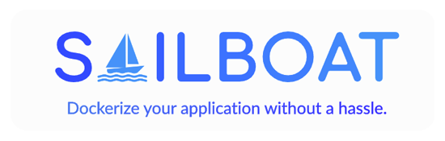

# Protein DevOps Engineer Bootcamp

## Project of the Third Week

**_Built with;_**

[![Linux][#linux]][@linux] [![Bash][#bash]][@bash] [![Docker][#docker]][@docker] [![Git][#git]][@git] [![VirtualBox][#virtualbox]][@virtualbox] [![Vagrant][#vagrant]][@vagrant]

#### :hash: **Assignment**

> Create a script that helps the developer to dockerize their applications, deploy it locally or push to a remote container registry.

> Provide a MySQL or MongoDB database service with Docker Compose in addition to the application.[^1]

**Script has to be able to ;**

> - Build and run docker images.
> - Push the image to the Docker Hub or Gitlab Container Registry.
> - Limit machine resources like CPU and memory if relevant arguments are given. _(Default is limitless)_
> - Deploy additional services like MySQL or Mongo Database with Docker Compose.

### **Table of Contents**

1. [Overview](#notebook_with_decorative_cover-overview)
2. [Features](#sparkles-features)
   - [Bootstrapper](#bootstrapper)
   - [Sailboat](#sailboat)
3. [Installation](#gear-installation)
   - [Automated](#automated)
   - [Manual](#manual)
4. [Usage](#wrench-usage)
   - [Parameters](#parameters)
5. [Technologies](#computer-technologies)
6. [Directories](#open_file_folder-directories)

### :notebook_with_decorative_cover: **Overview**

This repository contains an assignment project developed under the [Patika.dev][@patika] & [Protein][@protein] DevOps Engineer Bootcamp. `Bootstrapper` is an initializer script that sets up the machine as instructed. `Sailboat` is the main script that is coded by the terms of the project.

### :sparkles: **Features**

#### _Bootstrapper_

> - Sets the timezone of the machine as UTC+3 (Europe/Istanbul) and enables Network Time Protocol.
> - Downloads the latest package information.
> - Downloads, installs, and configures Docker Engine and Docker Compose.
> - Sets the permissions of the script files.
> - Defines a system-wide alias of the main script for easy use.

&nbsp;

<p align="center"></a></p>

#### _Sailboat_

> - Has three modes: Build, Deploy, and Template.
> - Build and deploy modes may take additional arguments like image name and image tag to define image properties.
> - Build mode may also take _"--registry"_ argument which will cause re-tag the image with the defined username.
> - The re-tagged image will be pushed to the specified container registry.
> - With deploy mode, you may also name your container and set CPU and memory limits.
> - Template mode will assist the user with predefined database services in addition to the main image.
> - Docker-compose is used in template mode with pre-defined database services are MySQL and MongoDB.

### :gear: **Installation**

##### _Automated_

1. Install [VirtualBox][@virtualbox] and [Vagrant][@vagrant-download] to your machine _if you do not have them_.
2. Clone the project to your machine.
3. Open your CLI, change directory to project directory, and type `vagrant up`.
4. Vagrant will configure the virtual machine first then you may test the project.

##### _Manual_

1. Download all of the project files.
2. Copy all scripts under the `/shared/scripts` and sample project from `/shared/projects/python` to your environment.
3. Execute `bootstrap.sh` first to configure the machine.
4. Make sure your environment has a Docker installation too.
5. Run the scripts with the aliases configured or manually from the directories that are stated [**below**](#open_file_folder-directories).

### :wrench: **Usage**

- Built-in alias is `sailboat` You may use it if you executed `bootstrap.sh` first.
- Optionally, you may call the scripts from any directory with an acceptable arguments that are stated below.
- The target directory of _Sailboat_ script is `/opt/projects/python` directory.
- You can change these settings by re-defining the `TARGET_DIR` variable within the configuration file of the script.

##### _Parameters_

```bash
OPTIONS:                 ARGUMENTS:                DESCRIPTION:                     OBLIGATION:

-m | --mode              <build|deploy|template>   Mode selection.                  Mandatory for ALL modes.
-n | --image-name        <image-name>              Docker image name.               Mandatory for BUILD and DEPLOY modes.
-t | --image-tag         <image-tag>               Docker image tag.                Mandatory for BUILD and DEPLOY modes.
-r | --registry          <dockerhub|gitlab>        Docker Hub or GitLab Registry.   Optional for BUILD Mode.
-c | --container-name    <container-name>          Container name.                  Optional for DEPLOY mode.
-p | --cpu               <cpu-limit>               Container CPU limit              Optional for DEPLOY mode.
-s | --memory            <memory-limit>            Container memory limit.          Optional for DEPLOY mode.
-a | --application-name  <mongo|mysql>             Run MySQL or MongoDB server.     Mandatory for TEMPLATE mode.
-h | --help                                        Shows this help message.
```

### :computer: **Technologies**

> - Linux
> - Bash Scripting
> - Git SCM
> - Docker :heart:
> - Oracle VM VirtualBox
> - Vagrant by HashiCorp

### :open_file_folder: **Directories**

```
Scripts             : /opt/scripts
Configurations      : /opt/scripts/configs
Sample Project      : /opt/projects/python
```

<!-- View Counter -->
<p align="right"></a></p>

<!-- Footnotes -->

[^1]: A simple Python application(flask) is provided as a sample project and the script is built upon this configuration. (Can be modified to any other project)

<!-- Badge Index -->

[#linux]: https://img.shields.io/badge/Linux-FCC624?style=flat&logo=linux&logoColor=black
[#bash]: https://img.shields.io/badge/Bash-4EAA25?style=flat&logo=GNU%20Bash&logoColor=white
[#git]: https://img.shields.io/badge/Git-E44C30?style=flat&logo=git&logoColor=white
[#docker]: https://img.shields.io/badge/Docker-2CA5E0?style=flat&logo=docker&logoColor=white
[#virtualbox]: https://img.shields.io/badge/VirtualBox-183A61?style=flat&logo=virtualbox&logoColor=white
[#vagrant]: https://img.shields.io/badge/Vagrant-1868F2?style=flat&logo=vagrant&logoColor=white

<!-- URL Index -->

[@patika]: https://www.patika.dev/
[@protein]: https://protein.tech/
[@linux]: https://www.linux.org/
[@bash]: https://www.gnu.org/software/bash/
[@docker]: https://www.docker.com/
[@git]: https://git-scm.com/
[@virtualbox]: https://www.virtualbox.org/
[@vagrant]: https://www.vagrantup.com/
[@vagrant-download]: https://www.vagrantup.com/downloads/
